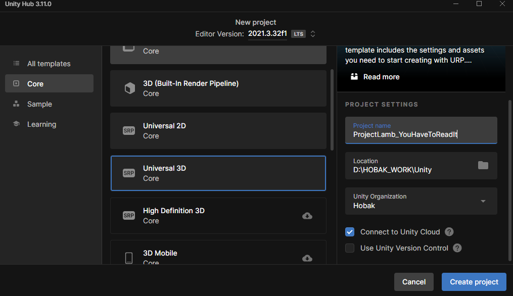

# ProjectLamb_YouHaveToReadIt
3rd Project of ProjectLamb

> YouHaveToReadIt 프로젝트 생성

#### 목차
1. [Git Setting](#1-git-setting)
2. [Git 협업시 지켜야 하는것들](#2-git-협업시-지켜야-하는것들)

---

## 1. Git Setting

### 0. 유니티 프로젝트 만들기

**① Clone 하기**
```bash
git clone https://github.com/ProjectLamb/ProjectLamb_YouHaveToReadIt.git
git fetch
```

**② 유니티 프로젝트 만들기**
<div align=center>
    
    <p>1. 3D(URP) 선택 <br>2. "ProjectLamb_YouHaveToReadIt" 으로 생성(가안)</p>
</div>

**③ 유니티 프로젝트에 clone한 내용을 그대로 덮어씌운다다**

---

### 1. 유니티 전용 .gitignore 설정

.gitingore 만들고, 다음 텍스트를 .gitingore에 넣기

```# Created by https://www.toptal.com/developers/gitignore/api/unity
# Edit at https://www.toptal.com/developers/gitignore?templates=unity

### Unity ###
# This .gitignore file should be placed at the root of your Unity project directory
#
# Get latest from https://github.com/github/gitignore/blob/main/Unity.gitignore
/[Ll]ibrary/
/[Tt]emp/
/[Oo]bj/
/[Bb]uild/
/[Bb]uilds/
/[Ll]ogs/
/[Uu]ser[Ss]ettings/

# MemoryCaptures can get excessive in size.
# They also could contain extremely sensitive data
/[Mm]emoryCaptures/

# Recordings can get excessive in size
/[Rr]ecordings/

# Uncomment this line if you wish to ignore the asset store tools plugin
# /[Aa]ssets/AssetStoreTools*

# Autogenerated Jetbrains Rider plugin
/[Aa]ssets/Plugins/Editor/JetBrains*

# Visual Studio cache directory
.vs/

# Gradle cache directory
.gradle/

# Autogenerated VS/MD/Consulo solution and project files
ExportedObj/
.consulo/
*.csproj
*.unityproj
*.sln
*.suo
*.tmp
*.user
*.userprefs
*.pidb
*.booproj
*.svd
*.pdb
*.mdb
*.opendb
*.VC.db

# Unity3D generated meta files
*.pidb.meta
*.pdb.meta
*.mdb.meta

# Unity3D generated file on crash reports
sysinfo.txt

# Builds
*.apk
*.aab
*.unitypackage
*.app

# Crashlytics generated file
crashlytics-build.properties

# Packed Addressables
/[Aa]ssets/[Aa]ddressable[Aa]ssets[Dd]ata/*/*.bin*

# Temporary auto-generated Android Assets
/[Aa]ssets/[Ss]treamingAssets/aa.meta
/[Aa]ssets/[Ss]treamingAssets/aa/*

# Ignore Plugins
Assets/Plugins/*
Assets/Packages/*
Assets/Resources/*
Assets/ResourcesHelper/*
Assets/FmodProject/*
Assets/ARTnGAME/*
Assets/BundleDemos/*
Assets/Feel/*
Assets/Pixel\ Crushers/*
Assets/Editor\ Default\ Resources/*
Assets/Gizmos/*
Assets/UserData.json

# Ignore Vscode
.vscode/

# Ignore JetBrains Rider
.idea

# Ignore Desktop Services Store (macOS file format)
.DS_Store

# End of https://www.toptal.com/developers/gitignore/api/unity

# Edit from neoskyclad
.fmod_editor.log
Assets/UserData.json
```

---

### 2. git window & mac 협업
**LF, CRLF 관련 오류**
서로 다른 OS간 git 사용때문에 발생하는 오류다 정확한것은 
OS에 맞는 설정을 구글에 꼭 찾아보길!
.gitconfig 설정

## 2. Git 협업시 지켜야 하는것들

<div align=center>
    
    <p> 이미지 출처 : https://openclipart.org/image/800px/278048 </p>
    <h4>GitFlow 방식을 통해 브랜치를 나누자</h4>
</div>

1. main은 항상 버젼 업데이트 할때만 Merge 하는것으로!
2. develop : 브랜치를 파서, 협업하는것을 합치는 "대리자 브랜치"로 사용
3. feature/guild : 이것으로 우리 각자의 브랜치를 파는것을 하자

> 관련 자료 

[그라운드 룰](https://www.notion.so/projectlamb/7b1c105044314431b46f77961ff3bf8d)

[(알아두면 개발팀장가능) GitFlow vs Trunk-based 협업방식](https://www.youtube.com/watch?v=EV3FZ3cWBp8)